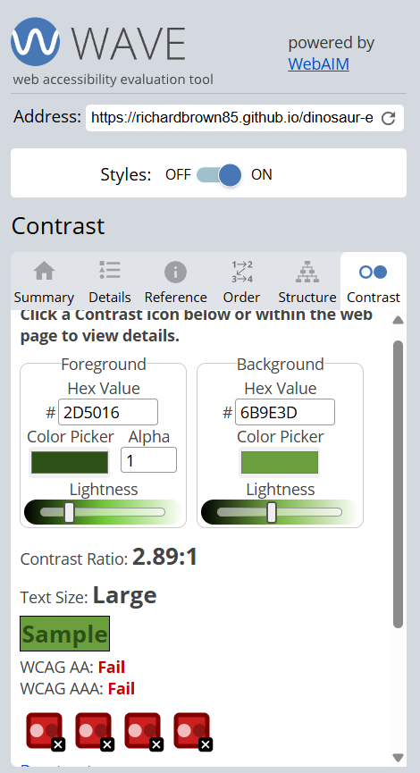
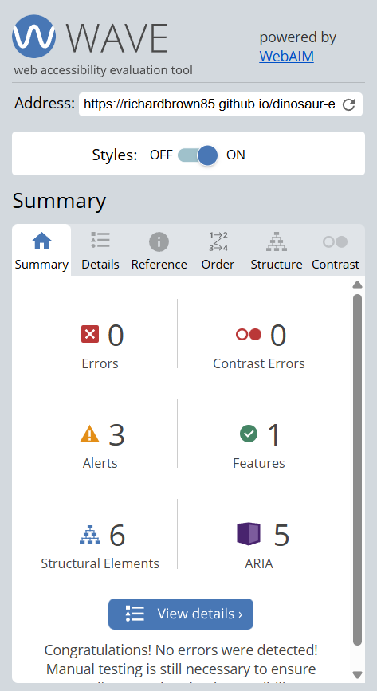
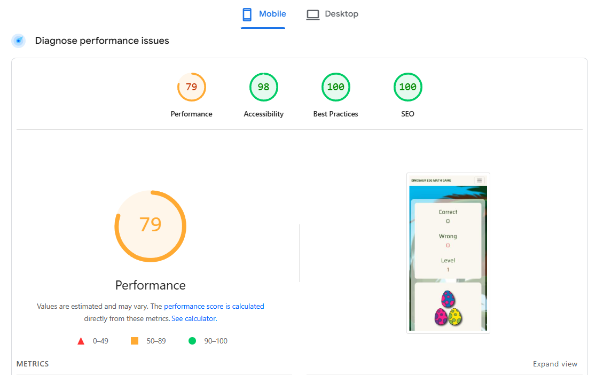

# Dinosaur-Egg-Math-Game

### View deployed game here

### Device mock up

### About the game

Dinosaur Egg Math Game is a simple, interactive online math game designed for children aged 3 and up. Players solve basic addition problems by choosing the correct number cards to solve the math problem. Each correct answer brings a colorful message, and a sense of discovery, while gradually increasing difficulty helps children build confidence and skills at their own pace. With short, engaging rounds, visual guidance, the game makes practicing math feel like play. Safe, ad-free, and easy to use, it’s a learning tool parents can trust and a joyful adventure kids will love.

The game has been optimised for tablet screens due to statistics suggesting 40% of kids under 3 have their own tablet!

### Game Goals

* Make math fun – Turn addition practice into an exciting adventure with dinosaurs, eggs, and playful rewards.
* Build confidence – Provide easy wins for young learners, gradually increasing difficulty so children feel proud of their progress.
* Encourage independent play – Design a simple, intuitive interface so children aged 3+ can play without constant help.
* Support learning at home – Give parents a safe, ad-free educational tool that helps their child develop foundational math skills.
* Motivate through discovery – Reward correct answers with positive feedback.
* Balance playtime – Offer short, engaging rounds that fit within healthy screen time limits for young children.
* Ensure safety and trust – Protect children by avoiding ads and personal data collection, making the game a secure learning environment.

# UX

### Ideal player

The ideal player is a curious and playful child aged 3 to 6 who is just beginning to explore numbers and simple math. They love bright colours and interacting with dinosaurs. Their attention span is short, so the game needs quick, rewarding rounds that make them feel successful without overwhelming them. They may not yet be confident readers, so the experience should rely on visuals, big, easy-to-tap buttons. What excites them most is the sense of discovery, celebrating small wins with cheers, stars, or confetti. For this young learner, the game is not just about practicing addition, but about building confidence, curiosity, and joy in learning through play.

### Ideal parent (the buyer/user who chooses the game for the child)

The ideal parent for this game is caring, tech-comfortable, and looking for safe, engaging educational activities for their young child aged 3–6. They want screen time to be meaningful, combining fun with real learning outcomes, especially early math skills like addition. This parent values simple, ad-free experiences that their child can navigate independently, but also appreciates being able to track progress and see where their child might need extra support. They are protective about online safety and privacy, preferring games that don’t collect personal data or expose their child to inappropriate content. What matters most to them is seeing their child light up with excitement when learning—whether that’s proudly demonstrating their growing confidence with numbers. For these parents, the game is not just entertainment, but a trusted tool that nurtures both learning and joy.

## User stories

### User stories (perspective of parents)

#### Core Gameplay

* As a parent, I want my child to practice addition in a fun way, so they stay engaged while learning.
* As a parent, I want the game to use dinosaur eggs and cards, so my child feels excited and motivated to keep playing.
* As a parent, I want the game to adapt to my child’s skill level (easy sums first, harder ones later), so they don’t get frustrated or bored.
* As a parent, I want the game to give positive feedback when my child answers correctly, so they feel encouraged.

#### Learning & Progress

* As a parent, I want to track how many correct answers my child gets, so I can see their improvement.
* As a parent, I want the game to show my child’s progress over time (like levels), so they stay motivated.
* As a parent, I want the game to highlight when my child struggles addition problems, so I know where they need extra practice.

#### Accessibility & Ease of Use

* As a parent, I want the game to be simple enough for my child to play independently, so they can enjoy it without constant help.
* As a parent, I want the interface to use big, colorful buttons and clear numbers, so my child can interact without confusion.
* As a parent, I want the game to work on a tablet or computer, so my child can play on whichever device is available.

#### Safety & Control

* As a parent, I want the game to be free from ads, so my child isn’t distracted or exposed to inappropriate content.
* As a parent, I want the option to set a playtime limit, so my child doesn’t play too long in one sitting.
* As a parent, I want reassurance that the game is safe and does not collect personal data, so I can trust it for my child.

### User stories (Since the game is for very young players (age 3+), the user stories are simple, fun-focused, and developmentally appropriate. Here’s a set of child/player user stories written in kid-friendly language (but structured for development).)

#### Core Gameplay (Fun & Engagement)

* As a player, I want to tap on the dinosaur eggs to easily add them up, so I feel excited when I answer correctly.
* As a player, I want to see colorful eggs, so playing feels like a game and not homework.
* As a player, I want to see when I get answers right, so I feel proud and happy.

#### Learning & Challenge

* As a player, I want the numbers to start easy, so I can win and feel good about myself.
* As a player, I want the game to give me hints if I get stuck, so I can still figure it out.
* As a player, I want the game to get a little harder after I get good at it, so it stays fun and not boring.

#### Rewards & Motivation

* As a player, I want to see my correct answers so I can see what I’ve earned.
* As a player, I want to see colourful eggs, so I’m excited to keep playing.
* As a player, I want stars, cheers, or confetti when I get an answer right, so I feel proud.

#### Ease of Play

* As a player, I want big buttons and pictures, so it’s easy for me to tap the right thing.
* As a player, I want the game to be short and fun, so I don’t get tired.

## Research before starting wireframe mock ups

I conducted some research before I started the mock up stages of the game design layout. I research into educational games for young learners 3+.
Orchard toys is one of the lead manufacturer of educational games and puzzles. They can be found via this link https://www.orchardtoys.com/

## Dinosaur Egg Math Game wireframe mock ups using Balsamiq

### Home page

### Game page

### Modals

## Features

The game features a responsive navbar for easy navigation to the game. There are two pages home page and game page. There are three ways to get to the game page. Game title and play game links on the navbar go to the the game page. There is also a large size play game button for kids to easier access the game on their own under the paragarph description of the game.

Both pages home and game screen have the same background which is responsive across all screens.

#### Home page

Home page features the navbar there is a title of the game which also acts as a link to the game page. Bright and bold in a very playful font. This also has a hover effect to notify users it's active by changing colour.

The play game and instructions also have the same effect. This changes to a hamburger icon on smaller screens.

The background is a colourful illustration of a dinosaur scene for an eye catching and is attention seeking for kids.

There is also a large play button that acts as a link for easy navigation for kids to get to the game screen.

#### Game page

Game page features full illustration of a dinosaur scene background the same as the home page in the middle of the screen there is a section that is slight transparent to see the background and fades smoothly into the scrore board and game area. The score board shows correct and wrong answer scores with a level counter to show what level the child has archieved.

Under the score board is the game area, the game area shows the addition (math problem) sums by showing two numbers, the numbers are shown in eggs as in 2 eggs for number 2 etc for the kids to count. There are multiple choice answers. The two choices are realistic in comparison to each other so it's easy for a child 3+ to choose from.

Underneath the score board and the game area there is a large exit button to exit the game by a link to the home page. This is the only exit button so it's easy accessible for all age groups especially children 3+.

## Typography and Colour Palette

### Typography

1. Primary Font (Paragraph and text)

#### Nunito Sans

* Style: Rounded, friendly and readable
* Use: Paragraphs, body of text
* Why: Strikes a balance between serious content and approachability, excellent readability and friendly feel

2. Secondary Font (Headers)

#### Saira

* Style: Bold, geometric, prehistoric feel
* Use: Headings, captions, taglines
* Why: Excellent readability at various sizes, contemporary design, strength and power - perfect for dinosaurs

### Web-friendly and Accessible:

* Optimized for screens
* Supported across all modern browsers
* Available for Google Fonts (fast CDN, easy integration)
* Highly readable at all sizes

### Color Palette/Scheme: "Jurassic Forest"

A high-contrast palette inspired for dinosaur themed game.

* Primary-color: #2D5016; Deep Forest Green
* Secondary-color: #8B4513; Saddle Brown
* Highlight-color: #6B9E3D; Vibrant Leaf Green
* Light-highlight-color: #F9F6F0; Soft Cream

Overall Score: Strong accessibility - The main text and primary colours all pass WCAG AA/AAA standards.

A Contrast Grid was created by using [Eight Shapes](https://contrast-grid.eightshapes.com/)

## Technologies used

- This project uses HTML, CSS and JavaScript programming languages.
- Github - VScode was used for the IDE (any can be used) connected to Github for the repository and deployment of website.
- Bootstrap CDN - The project uses Bootstrap V5.3 a grid system was used to structure the website and make it responsive easily and    Bootstrap CSS 5 which is used on the homepage and gamepage.
- Google fonts - The project uses google fonts to import the selection typography for the website.
- Font Awesome - The project uses font Awesome for social media icons (instagram and facebook).
- Favicon - Favicon link has been used to place the creative wave design in the navbar.
- Adobe illustrator and photoshop - Used for image creating, rendering and sizing.

## Testing

Testing was conducted on the deployed site through Github.

### Techologies used for testing
- Wave accessibilty evaluation tool https://wave.webaim.org/
- PageSpeed Insights (mobile and desktop) https://pagespeed.web.dev/
- W3C HTML Validation https://validator.w3.org/
- W3C CSS Validation https://jigsaw.w3.org/css-validator/

#### Functionality ( manual testing)

| Test | Test Action | Excepted results | Test results |
| ---- | ----------- | ---------------- | ------------ |
| Navbar link title | Test navigation to game page | Navigation to game page was easily accessible and easy to find | PASS |
| Instructions Navbar link | Test navigation for instructions modal | Navigation to instructions is easily accessible | PASS |
| Instructions modal and close button | Test instruction modal and close button displays and works | Modal and close button work and displays the correct information to play the game successsful | PASS |
| Play game Navbar link | Test navigation to game page | Navigation to game page is easily accessible | PASS |
| Play game button | Test navigation to game page | Navigation to game page is easily accessible | PASS |
| Reset Game Navbar link| Test navigation to reset game | Navigation to game page is easily accessible, refresh brower as a reset | PASS |
| Exit game Navbar link | Test the navigation to exit game | Navigation to exit the game back to the homepage is accessible and works | PASS |
| Exit game button | Test navigation to homepage from exit game button | Navigation to homepage from exit game button is accessible and works | PASS |
| Hover over image cards | Test if hover works continuous for image cards | Hover works as it should for image cards | PASS |
| Multiple choice buttons | Test mutiple choice buttons, hover and change of color | Multiple choice buttons work as they should | PASS |
| Correct answer modal and next question button | Test correct answer modal and next question button | Modal pops up if answer is correct, displays the correct information and next question button works | PASS |
| Level up modal and continue playing button | Test level up modal and continue playing button | Modal pops up if level up is archieved, displays the correct information and continue playing button works to carry on | PASS |

### Accessibility

Accessibilty testing was conducted using [Wave](https://wave.webaim.org/). 

Test 1 - Homepage

 

#### Accessibility Fix Log

Here is the log for the error and fix.

| Area/Component | Issue Description | Metric Before | Metric After | Commit Hash | Testing Tool | Notes/Reflection |
|----------------|-------------------|----------------|---------------|--------------|----------------|------------------|
| Navbar, Footer and Instructions modal | Low contrast (failed WCAG AA) | 2.89:1 | 8.5 (AAA) ✅ | 5cfe1bf38abad71f047dcbc88f4a7d710c05086c | Wave | Improved color legibility and visual consistency |

#### Reflective Commentary

**Summary:**  
After the Wave accessibility test on the home page the color contrast ratio failed on the navbar, footer and instruction modal.

**Reflection:**  
During this fix, The color contrast ratio improved from 2.89:1 to 8.5 by changing the background color to #F9F6F0.
When the navbar is hovered over the contrast ratio has always improved from a 1.3 to 6.5. The navbar and footer have a consistency from
home page through to the game page making the UI more inclusive and be compliant with WCAG AA/AAA. This also includes the instruction modal. The background has now be changed to match the navbar and footer with #F9F6F0. The modal close button has been changed also with the background color and hover to improved UI and be compliant with WCAG AA/AAA.

The test through Wave was re-run and the result -

Test 2 - Game page

### Browser Compatibility

The deployed site works on the following internet browsers
- Google Chrome
- Firefox
- Edge

### Responsiveness

The deployed site has been tested across different screen sizes for responsiveness.
The behaviour of the site was to be excepted. The site responded accordingly from 320px through to 2560px.

### PageSpeed Insights

PageSpeed Insights was used for desktop and mobile testing [PageSpeed Insights](https://pagespeed.web.dev/)

#### Home page (index.html) - Mobile

[PageSpeed Insights results link](https://pagespeed.web.dev/analysis/https-richardbrown85-github-io-dinosaur-egg-math-game-v2-index-html/3jpodr1yqj?form_factor=mobile)

#### Game page (index.html) - Desktop

[PageSpeed Insights results link](https://pagespeed.web.dev/analysis/https-richardbrown85-github-io-dinosaur-egg-math-game-v2-index-html/3jpodr1yqj?form_factor=desktop)

## Deployment

This project was developed using [VScode](https://code.visualstudio.com/), commited to git and pushed to GitHub using the built in function within VScode.

This site is hosted using GitHub pages, deployed directly from the master branch. The deployed site will update automatically upon new commits to the master branch. In order for the site to deploy correctly on GitHub pages, the landing page must be named index.html.

These are the steps that can be taken to deploy the page on GitHub pages from it's [GitHub repository](https://github.com/Richardbrown85/creative-wave-design-website):

    1. Log into GitHub.
    2. From the list of repositories on the screen, select Richardbrown85/creative-wave-design-website.
    3. From the menu items near the top of the page, select Settings.
    4. Scroll down to the GitHub Pages section.
    5. Under Source the drop-down menu should display Deploy from a branch
    6. On selecting Main Branch the page is automatically refreshed, the website is now deployed.
    7. Scroll back up to the GitHub Pages section to retrieve the link to the deployed website.

The deployed site can also be found on the repository page on the right handside under Deployments.

To run locally, you can clone this repository directly into the editor of your choice by pasting git clone into your terminal. This can be found on the main repository page, clicking the code button and copy to cut ties with this GitHub repository, type git remote rm origin into the terminal.

## Credits

### Content

### Media

- Background image for the game was downloaded from [Freepik](https://www.freepik.com/)

[Image link](https://www.freepik.com/free-vector/colorful-dinosaurs-prehistoric-jungle_222493145.htm#fromView=search&page=3&position=28&uuid=e3415ab1-4e3f-4308-a0df-6f418e443c2b&query=dinosaur+background)

### Code
 - Custom CSS code was written by me.
 - Some HTML was imported directly from Bootstrap V5.3 - Grid systems - rows, columns and cards. Navigation bar.
 - All Javascript was my own code with some hints from the use of [Claude ai](https://claude.ai/new)

###

I want to say a massive thank you to my mentor (Brian Macharia) as he has guiding me through yet another project from start to finish.

#### Disclaimer

The content of this website is my own piece of work which I am otherwise the sole author. 
I understand both the meaning and consequences of plagiarism.
